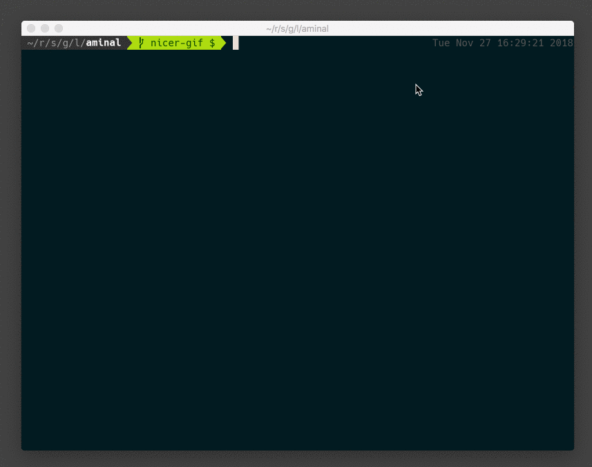

# Aminal - A Modern Terminal Emulator

Aminal is a modern terminal emulator implemented in Golang and utilising OpenGL. Whilst the basic functionality is in place, we're not yet at the stage to make a public release. Feel free to build and play with it though!

The project is experimental at the moment, so you probably won't want to rely on Aminal as your main terminal for a while.

Ensure you have your latest graphics card drivers installed before use.

## Aims

- Full unicode support
- OpenGL rendering
- Full customisation options
- True colour support
- Support for commmon ANSI escape sequences a la xterm
- Scrollback buffer
- Clipboard access
- Clickable URLs
- Resize logic that wraps/unwraps lines _correctly_
- Bullshit graphical effects
- Multi platform support

## What isn't supported?

- Suspend/Continue (\^S, \^Q). This is archaic bullshit that annoys more people than it helps. Basically:

## Build Dependencies

- Go 1.10.3+
- On macOS, you need Xcode or Command Line Tools for Xcode (`xcode-select --install`) for required headers and libraries.
- On Ubuntu/Debian-like Linux distributions, you need `libgl1-mesa-dev xorg-dev`.
- On CentOS/Fedora-like Linux distributions, you need `libX11-devel libXcursor-devel libXrandr-devel libXinerama-devel mesa-libGL-devel libXi-devel`.

## Platform Support

| Platform | Supported |
| -------- | --------- |
| Linux    | ✔         |
| MacOSX   | ⏳        |
| Windows  | ⏳        |

## Planned Features

| Feature                     | Done | Notes |
|-----------------------------|------|-------|
| Pty allocation              | ✔    | 
| OpenGL rendering            | ✔    |
| 8-bit (256) colour          | ✔    |
| 24-bit (true) colour        | ✔    |
| Resizing/content reordering | ✔    | 
| ANSI escape codes           | ✔    | 
| UTF-8 input                 | ✔    | 
| UTF-8 output                | ✔    | 
| Copy/paste                  | ✔    | 
| Customisable colour schemes | ✔    | 
| Config file                 | ✔    |
| Scrolling                   | ✔    | 
| Mouse interaction           | ✔    | 
| Sweet render effects        |      | 

## Keyboard Shortcuts

| Operation          | Key(s)           |
| ------------------ | ---------------- |
| Copy               | ctrl + shift + c |
| Paste              | ctrl + shift + v |
| Toggle slomo       | ctrl + shift + ; |
| Interrupt (SIGINT) | ctrl + c         |

## Configuration

Aminal looks for a config file in `~/.aminal.toml`, and will write one there the first time it runs, if it doesn't already exist.

You can ignore the config and use defaults by specifying `--ignore-config` as a CLI flag.

### Config Options/CLI Flags

| CLI Flag         | Config Section | Config Name    | Type    | Default | Description                                                                                                                   |
| ---------------- | -------------- | -------------- | ------- | ------- | ----------------------------------------------------------------------------------------------------------------------------- |
| --debug          | _root_         | debug          | boolean | false   | Enable debug mode, with debug logging and debug info terminal overlay.                                                        |
| --slomo          | _root_         | slomo          | boolean | false   | Enable slomo mode, delay the handling of each incoming byte (or escape sequence) from the pty by 100ms. Useful for debugging. |
| --always-repaint | rendering      | always_repaint | boolean | false   | Redraw the terminal GUI constantly, even when no changes have occurred.                                                       |
